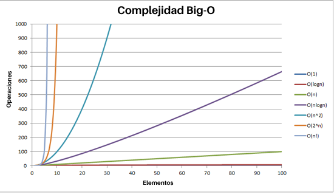

# Algoritmos y Notación Big O en Español Sencillo

Escrito en inglés por [Pavan Katepalli](https://github.com/pavankat)
[Ver versión original en inglés](https://github.com/pavankat/big-o-in-plain-english)

Traducido al español por [Iván R. Artiles](https://github.com/ivanr3d)

Editado en inglés por 
[Nick Bartlett](https://github.com/tteltrab)
[Nick West](https://github.com/njwest)


## ¿Qué son los algoritmos?

Los algoritmos son básicamente funciones.

Las funciones que son algoritmos:

1. reciben argumentos

2. devuelven valores explícitamente

#### 1.1 Ejemplo de un algoritmo

Algoritmo que cuenta el número de vocales en una palabra y devuelve el conteo:

```js
function contarVocales(palabra) {
    var vocales = ['a', 'i', 'e', 'o', 'u'];
    var conteo = 0;
	for (var i = 0; i < palabra.length; i++) {
		for (var j = 0; j < vocales.length; j++) {
			if (palabra[i] === vocales[j]) {
				conteo++;
			}
		}
	}
    return conteo;
}
```

## ¿Cuándo las funciones no son algoritmos?
Cuando escribes una función, puede que

* no tenga argumentos

* no devuelva un valor

Las funciones que no reciben argumentos ni devuelven un valor se suelen utilizar para evitar código repetitivo, imprimir algo en la pantalla, o servir como argumento a ser ejecutado más tarde. Este tipo de funciones típicamente no se consideran algoritmos.

#### 1.2 Ejemplo de una función que no es un algoritmo

Una función anónima que se pasa a la función `on` de jQuery. 

```js
$('button').on('click', function(){ 
	alert('hola') 
});
```

#### 1.3 Ejemplo de una función que no es un algoritmo

Esta función no tiene argumentos, ni retorno

```js
function limpiarDiv(){
	$('#div').html("");
}
```
#### 1.4 Ejemplo de una función que no es un algoritmo

Esta función tiene un argumento, pero no tiene retorno

```js
function limpiarDiv(texto){
	$('#div').text(texto);
}
```

## ¿Qué es Big O?

Big O es la abreviatura de Notación Big O.

Big O es la forma en que los programadores hablan sobre la escalabilidad de los algoritmos.

La Notación Big O de un algoritmo se determina por cuánto tiempo tarda el algoritmo en devolver una salida en el **peor escenario posible**.

El término matemático para el **peor escenario posible** es **"límite superior"**.

## ¿Cómo se pronuncia O(n)?

O(n) se pronuncia como "Orden de N" o simplemente "O de N".

La función O es la función de Orden.

## ¿Por qué se llama Big O?

Porque estamos tratando con órdenes de magnitud. Se usa `O` porque la tasa de crecimiento de una función también se refiere como el **"orden de la función"**.

## ¿Por qué es importante Big O?

Entender la notación Big O de los algoritmos te permitirá:
* Ponerte en la mentalidad de programar con eficiencia. Ej: "¡Tengo que cambiar este algoritmo porque es O(n!)!"
* Ayudarte a hablar de código con otros desarrolladores. Ej: "No te preocupes, cambié el algoritmo para que no sea O(n^2). Ahora es O(n)."
* Ayudarte en entrevistas. Podrás hablar sobre la eficiencia de los algoritmos que escribas en una pizarra. Ej: "Lo que acabo de codificar es O(n^2)."

## Profundizando en O(1)

#### Ejemplo 2.1

```js
function retornarElemento(elemento){
	return elemento;
}
```

`retornarElemento` es una función sin sentido, pero sigue conmigo.

```js
retornarElemento(2);
```

El Big O de `retornarElemento` es tiempo constante. No importa qué le pasemos a `retornarElemento`, el algoritmo realizará una unidad de trabajo.

La "complejidad" de esta función es `O(1)`.

Si quisieras graficar `O(1)`, deberías establecer y igual a 1 y graficarlo.

**y = 1**


Nota que por más a la derecha de la horizontal (eje x) que vayas, el eje vertical (eje y) permanece igual.

## Profundizando en O(n)

#### Ejemplo 2.2
```js
function elementoEnLista(verificar, lista){
	for (var i = 0; i < lista.length; i++){
		if (lista[i] === verificar) return true;
	}
	return false;
}
```

Esto se ejecutará bastante rápido:

```js
elementoEnLista(2, [1,2,3]);
```

La "complejidad" de `elementoEnLista` es `O(n)`.

Esto significa que es un gráfico lineal.

Para `elementoEnLista`, si la longitud del array es 3; en el **peor caso** tomará 3 unidades de trabajo.

Claro, en el mejor caso tomará 1 unidad de trabajo, pero la Notación Big O no trata sobre el mejor escenario, trata sobre el **peor escenario**.

Si quisieras graficar `O(n)` entonces reemplazarías la `n` con una `x` y la igualarías a una `y`.

**y = x**


Nota que cuanto más a la derecha de la horizontal (eje x) vayas, el eje vertical (eje y) también sube.

## Profundizando en O(n^2)

#### Ejemplo 2.3
```js
function todasLasCombos(lista){
	var resultados = [];
	for (var i = 0; i < lista.length; i++){
		for (var j = 0; j < lista.length; j++){
			resultados.push([i, j]);
		}
	}
}
```

Si hacemos `todasLasCombos([1,2,3])` obtendremos `[(1,1), (1,2), (1,3), (2,1), (2,2), (2,3), (3,1), (3,2), (3,3)]`.

La "complejidad" de `todasLasCombos` es `O(n^2)`.

La longitud del argumento lista de `todasLasCombos` es la `n` en `O(n^2)`.

todasLasCombos([1]) -> [[1,1]]. Una unidad de trabajo.  1^2 = 1  
todasLasCombos([1,2]) -> [[1,1], [1,2], [2,1], [2,2]]. Cuatro unidades de trabajo. 2^2 = 4

Así que n * n es n^2.

## Comparación de O(1), O(n) y O(n^2)

Nota que cuanto más a la derecha de la horizontal (eje x) vayas, el eje vertical (eje y) sube más rápido para `O(n^2)`, más lento para `O(n)` y constante para `O(1)`.

Esto significa que `O(n^2)` se ejecuta más lento que `O(n)`, que se ejecuta más lento que `O(1)`.


## O(1) vs O(n) vs O(n^2) explicado sin código

#### O(1)
Imagina que estás sumando números de un solo dígito, como cuando aprendiste en la escuela:

```
5 + 5 = 10

3 + 3 = 6

2 + 2 = 4

2 + 3 = 5

6 + 7 = 13
```

Cada una de estas sumas requiere la misma cantidad de pasos para completarse (o la misma cantidad de unidades de trabajo). Tomas un número, lo sumas al otro, y ya está. No importa cuáles sean los números, siempre tomará el mismo tiempo y esfuerzo.

Esto es lo que se conoce como `O(1)`, o tiempo constante, porque la cantidad de trabajo no cambia sin importar el tamaño del problema.

#### O(n)

Ahora, piensa en sumar números con más dígitos:

```
55 + 72 = 127

455 + 322 = 777

1234 + 4447 = 5681

4999 + 56 = 5055
```

Lo que debes notar es que, a medida que los números se vuelven más grandes, tienes que hacer más pasos para sumarlos. Es decir, si uno de los números tiene más dígitos, vas a tener que hacer más operaciones, como sumar columnas y llevar números.

El tiempo que te lleva hacer la suma depende directamente del tamaño del número más grande, por lo que el esfuerzo crece de manera proporcional a la cantidad de dígitos. Esto es lo que llamamos `O(n)`, donde "n" es el número de dígitos: cuantas más cifras tiene el número, más trabajo te costará sumarlos. Esto tomaría, en el peor de los casos, `O(n)` unidades de trabajo.

#### O(n^2)

Finalmente, imagina multiplicar números grandes:

```
55538 * 92338 = 5128267844
```

Este es un proceso mucho más largo que la suma. Aquí, cada dígito del número de la derecha (92338) debe multiplicarse por cada dígito del número de la izquierda (55538). Esto hace que el trabajo crezca muy rápidamente.

Si estuvieras multiplicando dos números de 100 dígitos cada uno, tendrías que hacer aproximadamente 10,000 operaciones. Por eso, esta operación es un ejemplo de `O(n^2)`, lo que significa que el trabajo aumenta mucho más rápido a medida que los números se hacen más grandes, porque el tiempo requerido crece con el cuadrado del número de dígitos. Esto tomaría, en el peor de los casos, `O(n^2)` unidades de trabajo para completarse.

## Profundizando en O(log(n))

O(1) < O(log(n)) < O(n) < O(n^2)


#### ¿Cómo es un algoritmo con una notación Big O de O(log(n))?

La elección del siguiente elemento sobre el cual realizar alguna acción es una de varias posibilidades, y solo una necesitará ser elegida.

#### Ejemplo: Buscar personas en una guía telefónica es O(log(n))

No necesitas revisar a todas las personas en la guía telefónica para encontrar la correcta; en su lugar, puedes aplicar un enfoque de [dividir y conquistar](https://es.wikipedia.org/wiki/Algoritmo_divide_y_vencer%C3%A1s), y solo necesitas explorar una pequeña fracción del espacio total antes de encontrar finalmente el número de teléfono de alguien. Como las guías teléfónicas vienen en orden alfabético, buscas la primera letra del nombre (habrás reducido el número a únicamente las personas con la misma inicial en su nombre), luego reduces a la segunda letra del nombre, y así hasta llegar al nombre que buscas.

Por supuesto, una guía telefónica más grande aún te llevará más tiempo, pero no crecerá tan rápido como el aumento proporcional en el tamaño adicional.

#### Ejemplo de un algoritmo que tiene un Big O de O(log(n))

```js
function divideEntreDos(x){
	var contador = 0;
	while (parseInt(x) > 1) {
		x = x / 2;
		contador = contador + 1;
	}
	return contador;
}
```

##### Calculando el Big O del algoritmo anterior

**sin matemáticas**

A menudo no necesitas matemáticas para averiguar cuál es el Big O de un algoritmo. Simplemente puedes usar tu intuición.

Observa cuántas unidades de trabajo tiene que hacer el algoritmo a medida que el tamaño de entrada crece y asóciala con la notación Big O correcta.

Sin contar la declaración de variables o el `return`:  
divideEntreDos(2) = 1. Las operaciones en cada paso del ciclo serían x = 2/1 (para la división) y contador = 0 + 1 (para el conteo); por lo que son 2 en total.  
divideEntreDos(4) = 2. Las operaciones serían `x = 4/2` y `contador = 0 + 1`, `2/1` y `1 + 1`; por lo que son 4 en total.  
divideEntreDos(8) = 3. Las operaciones serían `x = 8/2` y `contador = 0 + 1`, `4/2` y `1 + 1`, `2/2` y `2 + 1`; por lo que son 6 en total.  
divideEntreDos(16) = 4. Las operaciones serían `x = 16/2` y `contador = 0 + 1`, `8/2` y `1 + 1`, `4/2` y `2 + 1`, `2/2` y `3 + 1`; por lo que son 8 en total.  
divideEntreDos(32) = 5. Las operaciones serían `x = 32/2` y `contador = 0 + 1`, `16/2` y `1 + 1`, `8/2` y `2 + 1`, `4/2` y `3 + 1`, `2/2` y `4 + 1`; por lo que son 10 en total.  

La "complejidad" de divideEntreDos es `O(log(n))`.  

n    |  operaciones
-----|---------------
2    |  2
4    |  4
8    |  6
16   |  8
32   |  10
...  | ...
n    | 2 * log(n)

`log(n)` aquí esencialmente significa "la cantidad de veces que podemos dividir `n` entre 2".

**Nota:** Cuando escribes la notación Big O, se ignora el "2" inicial, ya que no cambia significativamente el comportamiento asintótico de la función para valores grandes de `n`. Así, podemos ver que `O(2 * log(n))` es equivalente a `O(log(n))`. En general, al escribir la notación Big O solo te preocupas por la porción más significativa de la complejidad (incluso `2n^2 + 2n` se escribiría como `O(n^2)`).
    
En este caso (`log(n)`), el tamaño del número es la `n`. Podemos ver que el número de operaciones no es constante, pero tampoco crece linealmente (y crece más lentamente a medida que `n` aumenta).

**caso general, con matemáticas** 

Iteración |   x
----------|--------
0         |  x (esto es lo mismo que x/1)
1         |  x/2
2         |  x/4
...       |  ...
k         |  x/2^k 

2^k = x → Aplicando logaritmo en ambos lados → k = log(x)

log(2^k) = log(x)

k*log(2) = log(x)

k = log(x)/log(2)

k es aproximadamente igual a log(x)

## Profundizando en O(n log n)

O(1) < O(log(n)) < O(n) < O(n log(n)) < O(n^2)

```js
// asume que n es un número entero
function nlogn(n){
	var resultados = [];
	for (var i = 0; i < n; i++){ // este bucle se ejecuta n veces, por lo tanto es O(n)
	    for (var j = n; j > 0; j = parseInt(j/2)){ // este bucle se ejecuta log(n) veces, por lo tanto es O(logn)
	    	resultados.push(j);
	    }
	}
	return resultados;
}
```

Para bucles for adyacentes (uno después del otro), sumarías los tiempos de ejecución, por ejemplo, `O(n + m)`. Para bucles for anidados, los multiplicas, por ejemplo, `O(n*m)`, o en este caso `O(nlogn)`.

Esto resultaría en:

```
nlogn(3)
[3, 1, 3, 1, 3, 1]
```

```
nlogn(4)
[4, 2, 1, 4, 2, 1, 4, 2, 1, 4, 2, 1]
```

## Profundizando en O(2^n)

Los algoritmos con un Big O de 2^n suelen ser recursivos.

```js
// asume que number es un número entero
function fib(number) {
 if (number <= 1) return number;
 return fib(number - 2) + fib(number - 1);
}
```

`O(2^n)` ocurre cuando un problema de tamaño `n` requiere resolver dos problemas más pequeños de tamaño `n-1` (en fibonacci esto es casi cierto, es solo que son dos problemas, uno de tamaño `n-1` y el otro de tamaño `n-2`). En esencia, estás duplicando el número de problemas que necesitas resolver cada vez que `n` aumenta.

Supongamos que nuestro algoritmo requiere dos operaciones, y que resolver un problema de tamaño `n` requiere resolver dos problemas de tamaño `n-1`. Entonces, el número de operaciones para valores crecientes de `n` son:

n   |  ops(n)
--- | ---
1   | 2 
2   | 4 = 2 + 2 = ops(2-1) + ops(2-1) = 2(2) = 2^2
3   | 8 = 4 + 4 = ops(3-1) + ops(3-1) = 2(4) = 2(2^2)= 2^3
4   | 16 = 8 + 8 = ops(4-1) + ops(4-1) = 2(8) = 2(2^3) = 2^4
...
k   | (k-1) + (k-1) = 2(k-1) = 2((k-2) + (k-2)) = 4(k-2) = 8(k-3) = ... = 2^(k-1)(2) = 2^k

## Profundizando en O(n!)

Cualquier algoritmo que calcule todas las permutaciones de un array dado es `O(n!)`. Factorial es el número que obtienes si multiplicas cada número desde 1 hasta `n`.

Imagina que tienes un array de palabras y quieres devolver todas las combinaciones posibles de esas palabras.

Entonces, dado
```
['manzana', 'oso', 'limp bizkit']
```

El algoritmo devolvería un array de 6 arrays. Como este:
```
[
	['manzana', 'oso', 'limp bizkit'],
	['manzana', 'limp bizkit', 'oso'],
	['oso', 'limp bizkit', 'manzana'],
	['oso', 'manzana', 'limp bizkit'],
	['limp bizkit', 'oso', 'manzana'],
	['limp bizkit', 'manzana', 'oso'],
]
```
Escribir un algoritmo que haga eso sería `O(n!)`. `n` aquí es la longitud del array, entonces 3! = 3 * 2 * 1 = 6. 

Otro ejemplo:

```js
// asume que n es un número entero
function nFactorial(n) {
  for (var i = 0; i < n; i++) {
    return nFactorial(n - 1);
  }
}
```

Esto ejecuta la función `nFactorial` `n-1` veces para una entrada `n`. Por lo tanto, obtienes `n*nFactorial(n-1)`.

`n*f(n-1) = n*(n-1)*f(n-2) = ... = n*(n-1)*(n-2)*...*1*f(1) = n!`.

## Big O puede ser engañoso

La notación Big-O es una estimación y solo es útil para valores grandes de `n`.

#### ordenamiento por inserción vs ordenamiento por mezcla

[Ordenamiento por inserción - Wikipedia](https://es.wikipedia.org/wiki/Ordenamiento_por_inserci%C3%B3n)
[Ordenamiento por mezcla - Wikipedia](https://es.wikipedia.org/wiki/Ordenamiento_por_mezcla)

El tiempo de ejecución en el peor de los casos para **el algoritmo de ordenamiento por inserción es O(n^2)**.

En relación con Big O, eso es peor que el tiempo de ejecución para **ordenamiento por mezcla, que es O(n log n)**.

¡Pero para pequeñas cantidades de datos (cuando `n` es pequeño), el ordenamiento por inserción es en realidad más rápido, especialmente si el array ya está parcialmente ordenado!

Big O es útil cuando se comparan dos algoritmos para determinar cuál es más rápido cuando `n` es grande.

Si la cantidad de datos (`n`) es relativamente pequeña, entonces incluso un algoritmo lento será lo suficientemente rápido para un uso práctico.

#### Otras consideraciones

El tiempo de ejecución promedio de los algoritmos puede variar significativamente según las diferentes entradas, pero la notación Big O solo indica el peor escenario. Por lo tanto, puedes tener un algoritmo que se ejecute en `logn` en el 99% de los casos, pero en el 1% del tiempo toma `n!`. Y otro que resuelve el mismo problema pero siempre se ejecuta en `n^2`. Así, la notación Big O no da una imagen completa de la eficiencia en tiempo de ejecución. Esto es particularmente notable cuando se observan los algoritmos de ordenamiento, que tienen diferentes tiempos de ejecución en el mejor, peor y promedio de los casos. Sin embargo, la mayoría de las discusiones en torno al análisis de tiempo de ejecución se centran en Big O y el tiempo de ejecución en el peor de los casos.

## Otras categorías de Big O de más rápida a más lenta

Big-O | Nombre | Descripción
------| ---- | -----------
**O(1)** | constante | **Esta es la mejor.** El algoritmo siempre toma la misma cantidad de tiempo, sin importar cuántos datos haya. En otras palabras, el número de unidades de trabajo que toma completar el algoritmo es independiente del tamaño de la entrada. Ejemplo: buscar un elemento en un array por su índice.
**O(log n)** | logarítmica | **Bastante bien.** Este tipo de algoritmos eliminan un porcentaje de la cantidad de datos a revisar con cada iteración. Si tienes 100 elementos, toma alrededor de 7 pasos encontrar la respuesta. Con 1,000 elementos, toma 10 pasos. Y con 1,000,000 elementos solo toma 20 pasos. Esto es súper rápido, incluso para grandes cantidades de datos. Ejemplo: búsqueda binaria (en un array ordenado).
**O(n)** | lineal | **Buen rendimiento.** Si tienes 100 elementos, hace 100 unidades de trabajo. Esto suele ser el caso de un bucle. Si duplicas el tamaño de `n`, entonces el algoritmo hace 2 * n unidades de trabajo. Ejemplo: búsqueda en un array no ordenado.
**O(n log n)** | "lineal-logarítmica" | **Rendimiento decente.** Esto es un poco peor que el rendimiento lineal, pero no está tan mal. Ejemplo: mergesort y otros algoritmos de ordenamiento "rápidos".
**O(n^2)** | cuadrática | **Algo lenta.** Si tienes 100 elementos, hace 100^2 = 10,000 unidades de trabajo. Duplicar el número de elementos lo hace cuatro veces más lento (porque 2 al cuadrado es igual a 4). Ejemplo: un doble bucle for -> tienes que revisar cada par de elementos de entrada.
**O(n^3)** | cúbica | **Mal rendimiento.** Si tienes 100 elementos, hace 100^3 = 1,000,000 unidades de trabajo. Duplicar el tamaño de la entrada lo hace ocho veces más lento. Ejemplo: multiplicación de matrices. O, estás mirando cada par de entradas, pero la operación que haces requiere mirar todas las entradas nuevamente.
**O(2^n)** | exponencial | **Muy mal rendimiento.** Quieres evitar este tipo de algoritmos, pero a veces no tienes otra opción. Agregar solo un bit a la entrada duplica el tiempo de ejecución. Ejemplo: adivinanza por fuerza bruta de los resultados de una secuencia de `n` lanzamientos de moneda.
**O(n!)** | factorial | **Intolerablemente lento.** Literalmente, toma millones de años hacer algo. Ejemplo: necesitas considerar todos los subconjuntos posibles de tus entradas. Echa un vistazo al problema del vendedor viajero: forzar una solución para este problema es `n!`.



## otro gráfico

Big-O | cálculos para 10 elementos | cálculos para 100 elementos
------| ---- | -----------
O(1)        |   1                         |     1
O(log(n))   |   3                         |     7
O(n)        |  10                         |   100
O(n log(n)) |  30                         |   700
O(n^2)      | 100                         | 10000
O(n^3)      | 1000                        | 1000000
O(2^n)      | 1024                        | 2^100
O(n!)      | 3628800                      | 100! -> matemáticamente este es el producto de (100 * 99 * 98...)

## y otro más

n   | logn | n  | nlogn | n^2 | 2^n | n!
--- | ---  |--- | ---   |---  | --- | ---
1   | 0    | 1  | 0     | 2   | 2   | 1
2   | 3.69 | 2  | 1.4   | 4   | 4   | 2
3   | 1.1  | 3  | 3.3   | 9   | 8   | 6
4   | 1.4  | 4  | 5.5   | 16  | 16  | 24
5   | 1.6  | 5  | 8     | 25  | 32  | 120
10  | 2.3  | 10 | 23    | 100 | 1024| 3628800 

## Examen rápido

¿Cuál es el Big O de cada uno de estos algoritmos?

a)

```js
function countUpA(n){
	var count = 0;
	for (var i = 1; i <= n; i++) {
        for (var j = n; j > 1; j--) {
            for (var k = 1; k < n; k = k + 2) {
                count++;
            }
        }
    }
    return count;
}
```

b)

```js
function countUpB(n){
	var count = 0;
	for (var i = 1; i <= n; i++) {
	    for (var j = n; j > 1; j--) {
	        for (var k = 1; k < 1000; k = k + 2) {
	            count++;
	        }
	    }
	}
	return count;
}
```

c)

```js
function countUpC(n){
	var count = n;
	for (var i = 1; i <= 1000000; i++) {
	    for (var j = i; j > 500; j--) {
	        for (var k = 1; k < 10500; k = k + 2) {
	            count++;
	        }
	    }
	}
	return count;
}
```

d)

```js
function countUp(n){
	var count = 0;
	var j = 1;
	for (var i = 1; i < n; i++) {
        while (j < n) {
            j++;
            count++;
        }
        j = 1;
	}
	return count;
}
```

e)

```js
function countUpE(n){
	var count = 0;
	var i = n;
	while (i > 1){
	    count++;
	    i = i / 2;
	}
	return count;
}
```

## Respuestas al Examen Rápido

a) O(n^3)

Bucle for triple; a medida que la entrada crece, las unidades de trabajo crecen a un ritmo cúbico.

b) O(n^2)

Bucle for triple, pero solo 2 de los bucles for aumentan las unidades de trabajo respecto a la entrada.

c) O(1)

A medida que la entrada crece, las unidades de trabajo siempre permanecen iguales.

d) O(n^2)

A medida que la entrada crece, las unidades de trabajo aumentan a un ritmo cuadrático.

e) O(log n)

A medida que la entrada crece, las unidades de trabajo aumentan, pero no a un ritmo lineal ni cuadrático.

## Recursos utilizados (en inglés)

Explicaciones:
https://justin.abrah.ms/computer-science/big-o-notation-explained.html
http://stackoverflow.com/questions/107165/big-o-for-eight-year-olds?rq=1

Ejemplos de código reescritos desde aquí:
http://stackoverflow.com/questions/17122807/big-o-ologn-code-example
http://stackoverflow.com/questions/19021150/big-oh-for-n-log-n

Gráficos/Diagramas utilizados:
https://github.com/raywenderlich/swift-algorithm-club/blob/master/Big-O%20Notation.markdown
https://www.quora.com/How-would-you-explain-O-log-n-in-algorithms-to-1st-year-undergrad-student
http://www.daveperrett.com/articles/2010/12/07/comp-sci-101-big-o-notation/

Examen rápido:
http://stackoverflow.com/questions/9223351/confused-on-big-o-notation?rq=1